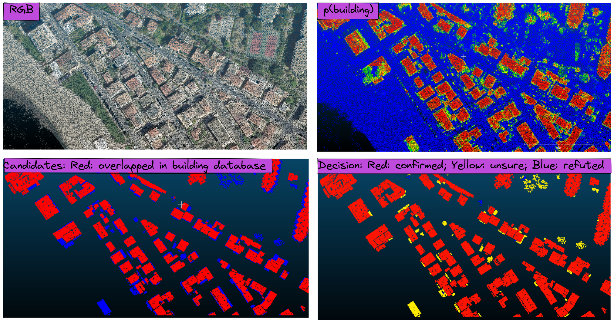

<div align="center">

# Semantic Segmentation - Inspection Module

<a href="https://pytorch.org/get-started/locally/"></a>
<a href="https://pytorchlightning.ai/"></a>
<a href="https://hydra.cc/"></a>

[](https://github.com/ashleve/lightning-hydra-template)
</div>
<br><br>

## Description
### Context
The Lidar HD project ambitions to map France in 3D using 10 pulse/m² aerial Lidar. The data will be openly available, including a semantic segmentation with a minimal number of classes: ground, vegetation, buildings, vehicles, bridges, others.

A simple geometric rule-based semantic segmentation algorithm was applied on 160km² of Lidar data in three areas, to identify its buildings. An audit of the resulting classification showed a large number of false positive. A thorought inspection and labelling was performed to evaluate the quality of this classification, with an identification of its false positive and false negative. At larger scale, this kind of human inspection would be intractable, and more powerful methods are needed to validate the quality of the segmentation before its diffusion.

### Content
We develop a validation module based on a deep learning neural network and on a building vector database.

- **Input**: point cloud that went through a first geometric algorithm that identified `candidates building points` based on geometric rules (e.g. plane surfaces, above 1.5m of the ground, etc.)
- **Output**: the same point cloud with a majority of groups of `candidates building points` either `confirmed` or `refuted`. The remaining groups are are labeled `unsure` for further human inspection.



The validation process is as follow
    
1) Prediction of point-level probabilities for a 1km*1km point cloud.
2) Clustering of candidate buildings points into connected components of _candidate buildings points_.
3) Point-level decision
    1) Decision at the point-level based on probabilities : `confirmed` if p>=`C1` /  `refuted` if (1-p)>=`R1`
    2) Identification of points that are `overlayed` by a building vector from the database.
3) Group-level decision :
    1) Confirmation: if proportion of `confirmed` points >= `C2` OR if proportion of `overlayed` points >= `O1`
    2) Refutation: if proportion of `refuted` points >= `R2` AND proportion of `overlayed` points < `O1`
    3) Uncertainty: elsewise.
4) Update of the point cloud classification

Decision thresholds `C1`, `C2`, `R1`, `R2`, `O1` are chosen via a multi-objective hyperparameter optimization that aims to maximize automation, precision, and recall of the decisions.

In this repository you will find three main components:

- `train.py`: Training and evaluation of the semantic segmentation neural network.
- `optimize.py`: Multi-objective hyperparameter optimization of the decision thresholds.
- `predict.py`: Applying the decision process on new point clouds.

## How to run
Install dependencies
```yaml
# clone project
git clone https://github.com/CharlesGaydon/Segmentation-Validation-Model
cd Segmentation-Validation-Model

# [OPTIONAL] If you want to use a gpu make sure cuda toolkit is installed
sudo apt install nvidia-cuda-toolkit

# install conda
https://www.anaconda.com/products/individual


# create conda environment (you may need to run lines manually as conda may not activate properly from bash script)
bash bash/setup_environment/setup_env.sh

# activate using
conda activate validation_module
```

Rename `.env_example` to `.env` and fill out `LOG PATH`. 

Sections `DATAMODULE`, and `LOGGER` are needed for training and evaluation. `INPUT_BD_TOPO_SHP_PATH` is currently needed for optimization and inference.


### To run the module on unseen data with a trained model 

To run the module on unseen data that went through rule-based semantic segmentation, you will need:

1. A checkpointed trained building segmentation Model
2. A `.hydra` directory with the configurations used to establish the checkpointed Model (including receptive field size, subsampling parameters, etc.)
3. A pickled Optuna "Best trial" which contains optimized decision thresholds
4. An input HD Lidar point cloud in LAS 1.4+ format (`EPSG:2154`) with a classification channel where a `CODE` value is indicative of candidate building points.

Then run:

```yaml
python run.py --config-path /path/to/.hydra --config-name config.yaml task=predict hydra.run.dir=path/to/Segmentation-Validation-Model +prediction.src_las=/path/to/input.las +prediction.resume_from_checkpoint=/path/to/checkpoints.ckpt +prediction.best_trial_pickle_path=/path/to/best_trial.pkl +prediction.output_dir=/path/to/save/updated/las/ +prediction.mts_auto_detected_code=CODE datamodule.batch_size=50
```

Please note that "hydra.run.dir" is the directory of the project, it's not a mistake (loading a different config from .hydra with "--config-path" may change that path, we currently need that step to put everything back).

### To run training, evaluation, and decision thresholds optimization on labeled data


Train model with a specific experiment from [configs/experiment/](configs/experiment/)
```yaml
# default
python run.py experiment=PN_debug
```

Evaluate the model and get inference results on the validation dataset
```yaml
# to evaluate and infer at the same time
python run.py experiment=PN_validate trainer.resume_from_checkpoint=/path/to/checkpoints.ckpt fit_the_model=false test_the_model=true
# to log IoU without saving predictions to new LAS files 
python run.py experiment=PN_validate callbacks.save_preds.save_predictions=false trainer.resume_from_checkpoint=/path/to/checkpoints.ckpt fit_the_model=false test_the_model=true
```
To evaluate on test data instead of val data, replace `experiment=PN_validate` by `experiment=PN_test`.


Run a multi-objectives hyperparameters optimization of the decision thresholds, to maximize recall and precision directly while also maximizing automation.

```yaml
python run.py -m task=optimize optimize.todo='prepare+optimize+evaluate+update' optimize.predicted_las_dirpath="/path/to/val/las/folder/" optimize.results_output_dir="/path/to/save/updated/val/las/"  optimize.best_trial_pickle_path="/path/to/best_trial.pkl"
```

To evaluate best solution on test set, simply change the input las folder and the results output folder, and remove the optimization from the todo. The path to the best trial stays the same.

```yaml
python run.py task=optimize optimize.todo='prepare+evaluate+update' print_config=false optimize.predicted_las_dirpath="/path/to/test/las/folder/" optimize.results_output_dir="/path/to/save/updated/test/las/" optimize.best_trial_pickle_path="/path/to/best_trial.pkl"
```

Additionally, if you want to update the las classification based on those decisions, add an `optimize.update_las=true` argument.
